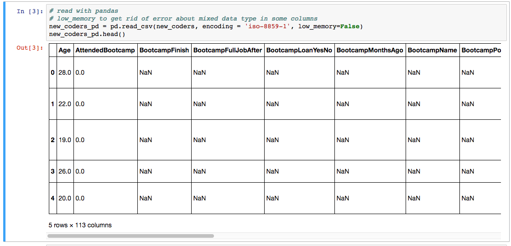
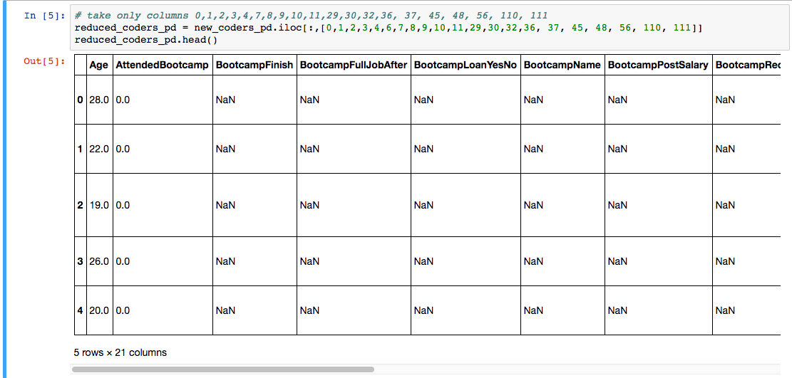
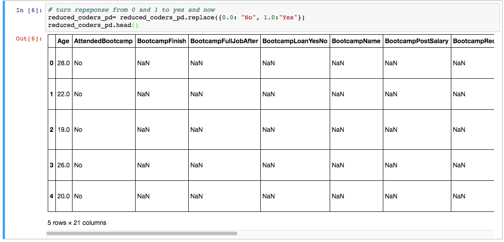
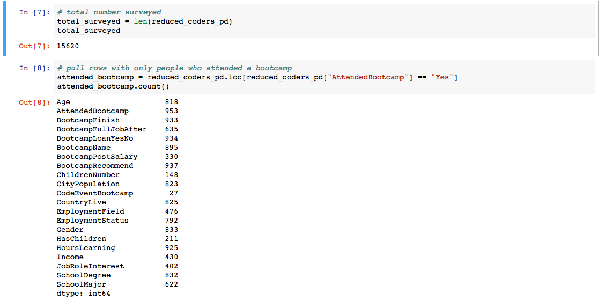
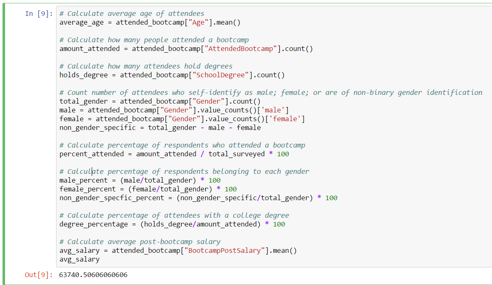
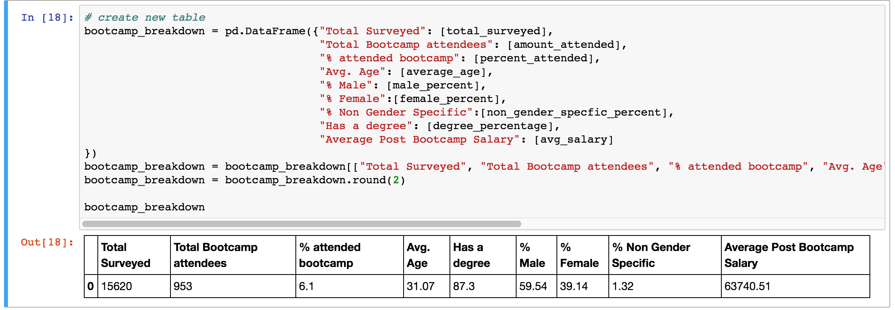
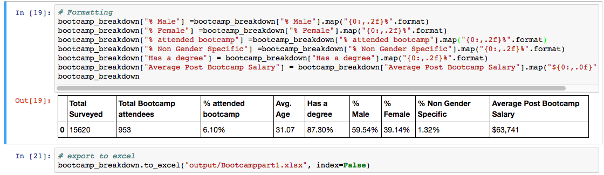

### Python Mini-Project: Data Clean-Up I

* Data is inherently dirty. It often contains more information than is needed, columns are often mislabeled, and values are often missing or in the wrong format. This project will require you to use most of what you have  learned to fix just such a problem in a real-world data set.

* **Resources:**

  * [2016-FCC-New-Coders-Survey-Data.csv](Resources/2016-FCC-New-Coders-Survey-Data.csv)

* **Instructions:**

  * The goal for this assignment is to recreate [ExampleOutputTask1.xlsx](Pandas_Mini_Project_Task_1/output/ExampleOutputTask1.xlsx).

  * Using Pandas, load the [CSV provided in Resources](Pandas_Mini_Project_Task_1/Resources/2016-FCC-New-Coders-Survey-Data.csv).

  * Create a new table using the following columns: `[0, 1, 2, 3, 4, 7, 8, 9, 10, 11, 29, 30, 32, 36, 37, 45, 48, 56, 110, 111]`.

  * The data set currently uses 0.0 to represent "No" or "False", and "1.0" to represent "Yes"/"True"—an entry of 0.0 for row 2 in the **Attended Bootcamp** column, for instance, indicates that the respondent with ID 2 did not attend a bootcamp. Replace all instances of "0.0" with No, and all instances of "1.0" with "Yes".

  * Calculate the total number of respondents in the sub-table you built.

  * Create a table out of the rows corresponding only to people who _did_ attend a bootcamp.

  * Calculate the number of people who attended a bootcamp.

  * Calculate the average age of bootcamp attendees.

  * Calculate the number of bootcamp attendees who self-identify as male; female; or neither.

  * Calculate the number of bootcamp attendees who hold college degrees.

  * Calculate the percentage of respondents who attended a bootcamp.

  * Calculate the percentage of people who attended a bootcamp and hold a college degree.

  * Calculate the average post-bootcamp salary.

  * Create a new, two-row table collecting the above data.

  * Use the `format` method to prettify your table—i.e., use `format` to display percents as percents; display numbers to a reasonable number of decimal points; etc.

  * Finally, export the final table into an Excel file.

### Helpful Project Hints
* The hints below are incredibly helpful for completing Part 1 of this project. Enjoy these, because there will not be as many hints for the second part. Please use Jupyter Notebook to complete this mini-project.

  * You can set the  `low_memory` parameter in the `read_csv` function to False so that no annoying warnings pop up.

    

  * This dataset contains far more columns than are necessary for the purposes of this application. You can use the `iloc` method to select columns by position and extract specific columns from a DataFrame by _position_. .

    

  * The data set uses "0.0" to represent "No", and "1.0" to represent "Yes" within columns like "Attended Bootcamp". It would be better if the data used "No" and "Yes" explicitly, instead of "0.0" and "1.0". The `replace` method can be utilized to accomplish this.

    

  * The length of the DataFrame can be used to determine the number of respondents.

  * Think about how you would select only people who attended a bootcamp. The `loc` method and a boolean test can be used to extract only the rows corresponding to people who attended a bootcamp.

    

  * Once you whittled down your data, you can start calculating the values that the are really interesting.

  * As a hint, pay attention to the calculations within the image below. Note `mean`, `count`, and other such data functions.

    

  * Using the data calculated, create a new summary table containing only the information gathered.

    

  * Finally, note how the `format` method is used to "prettify" the table before exporting it to an Excel file.

    

  * These instructions provide **a great deal of hints**! Work with your team members to complete this.
