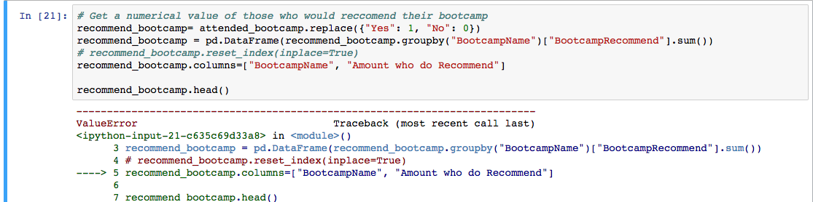
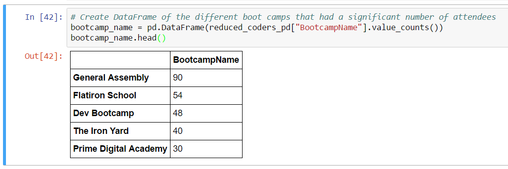

### Python Mini-Project: Data Clean-Up, Pt. 2

* The second part of this project will require you to clean and explore the same dataset in order to generate a very different set of summary data.

* The solution should look similar to this:

  

* **Resources:**

  * [2016-FCC-New-Coders-Survey-Data.csv](Resources/2016-FCC-New-Coders-Survey-Data.csv)

* **Instructions:**

  * Create a new table using the following columns: `[0, 1, 2, 3, 4, 6, 7, 8, 9, 10, 11, 29, 30, 32, 36, 37, 45, 48, 56, 110, 111]`.

  * The dataset currently uses 0.0 to represent "No" or "False", and "1.0" to represent "Yes"/"True". Replace all instances of "0.0" with No, and all instances of "1.0" with "Yes".

  * Extract rows corresponding only to respondents who attended a bootcamp.

  * Create a DataFrame with two columns: One with the bootcamp name, and one with the number of respondents who went to each bootcamp.

  * Create another DataFrame with two columns: One for the bootcamp name, and one for the number of respondents who recommend it.

  * Create a new DataFrame by merging the previous two DataFrames on the appropriate column.

  * In your new DataFrame, create a new column containing the percentage of respondents for each bootcamp who would recommend that bootcamp.

  * Sort the new DataFrame in descending order of the percentage of recommenders you just calculated.

  * Use `map` and `format` to make the `"% Recommended"` column look more presentable.

  * Finally, export your DataFrame to an Excel file.

### Some Helpful Hints

* Use Jupyter Notebook to complete this task.

  * The first few steps — loading the data by extracting only rows for those who attended a bootcamp — are identical to the first task.

  * Remember that instructions call for you to  create a DataFrame selecting only the bootcamps that had a large number of attendees. `value_counts` can be used to determine how many people attended each bootcamp.

  * Hint: Think about why it will be necessary to use `reset_index`. The `bootcamp_name` DataFrame won't have an index _at all_ if this method is not used. Without an index it is not possible to filter or merge the DataFrame.

    
    

  * Using `value_counts` allows the application to create a DataFrame summarizing how many people attended each bootcamp in the data set. This is only about half of the data analysis necessary for this project.

  * Just as with the `Attended Bootcamp` column from before, the responses in the `BootcampRecommended` column use "1" to indicate "Yes", and "0" to indicate "No". The `replace` method from before can be used to change this.

  * Think about how to count the number of recommenders for each bootcamp. The DataFrame is first grouped by bootcamp name and then `sum` is used to count how many `BootcampRecommended` rows there are for each group.

  * Think about which columns in the `recommend_bootcamp` and `bootcamp_name` DataFrames would be good for merging. The tables will merge smoothly on the `BootcampName` column.

  * Calculate the percentage of students in each bootcamp who would recommend the bootcamp they attended. The `Recommenders` column can be divided by the `Count` column to accomplish this.

  * Sort the DataFrame in descending order of the percent of recommenders. `sort_values` is used and `"% Recommended"` is passed as the column to sort on.

  * Passing `ascending=False` forces a sort in descending order and calling `round(2)` on the result of `sort_values` truncates the percentages to only two decimal points.

  * Format the DataFrame to display percentages nicely. To accomplish this, the `map` method is used to string over the `"% Recommended"` column.

* This is a difficult project. Take deep breaths and be sure to work together!
